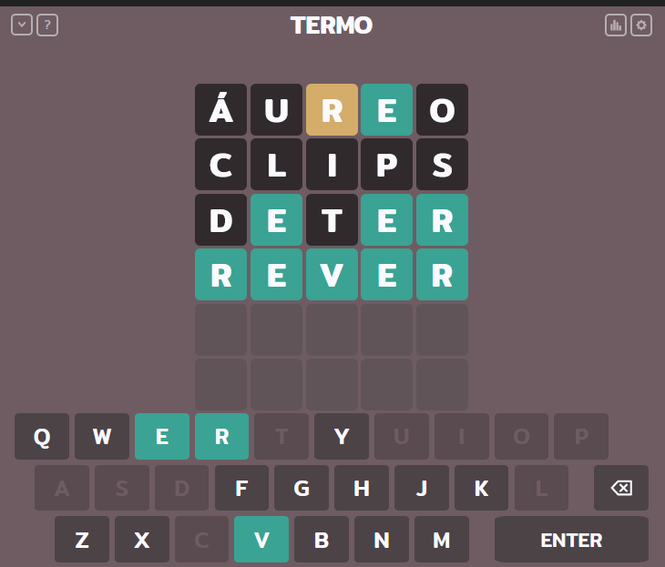

# termo-solver

> Projeto simples de resolução do jogo term.ooo. O jogo é similar a um jogo de forca, onde o usuário precisa descobrir uma palavra em até seis tentativas, mas precisa arriscar termos em vez de chutar qualquer letra

### Ajustes e melhorias

O projeto ainda está em desenvolvimento e as próximas atualizações serão voltadas nas seguintes tarefas:

- [x] Scraping e Manipulação do Site
- [x] Criação do dataframe para filtragem de palavras enviadas
- [ ] Tentativa de utilização de Machine Learning para resolução do jogo
